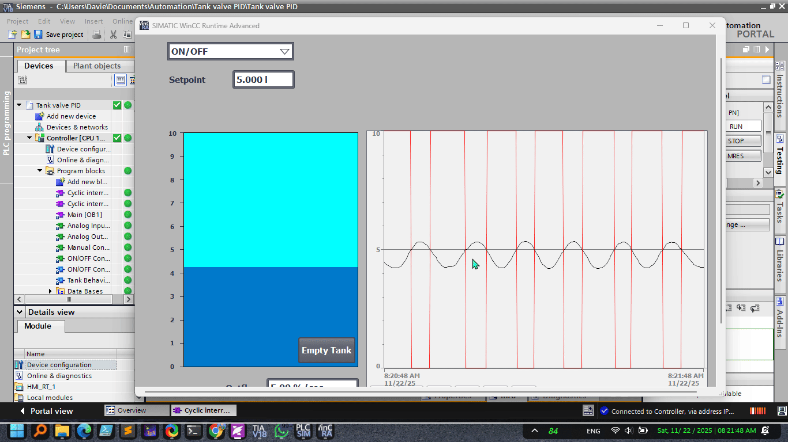

# Tank Valve PID Control System

A TIA Portal V18 project demonstrating PID control for maintaining a specified tank fill level.

## Visual Demonstrations

### System Diagram

*System overview diagram showing the tank valve PID control setup with level sensor, control valve, and PID controller*

### Animated Demonstration

*GIF animation demonstrating the PID controller dynamically adjusting the valve position to maintain the set tank fill level in real-time*

## Overview

This project demonstrates how a PID controller operates in TIA Portal to maintain a set tank fill level by automatically adjusting the valve position.

**Key Components:**
- **P (Proportional)**: Immediate response to error
- **I (Integral)**: Eliminates steady-state error
- **D (Derivative)**: Reduces overshoot and improves stability

## Getting Started

1. Open `Tank valve PID.ap18` in TIA Portal V18
2. Compile and download to PLC (or use simulation)
3. Set the desired tank level setpoint
4. Observe the PID controller maintaining the setpoint

## PID Tuning Tips

- **Oscillation**: Reduce Kp or increase Td
- **Slow Response**: Increase Kp or reduce Ti
- **Steady-State Error**: Adjust Ti
- **Overshoot**: Increase Td or reduce Kp

---

**Project Version**: TIA Portal V18
